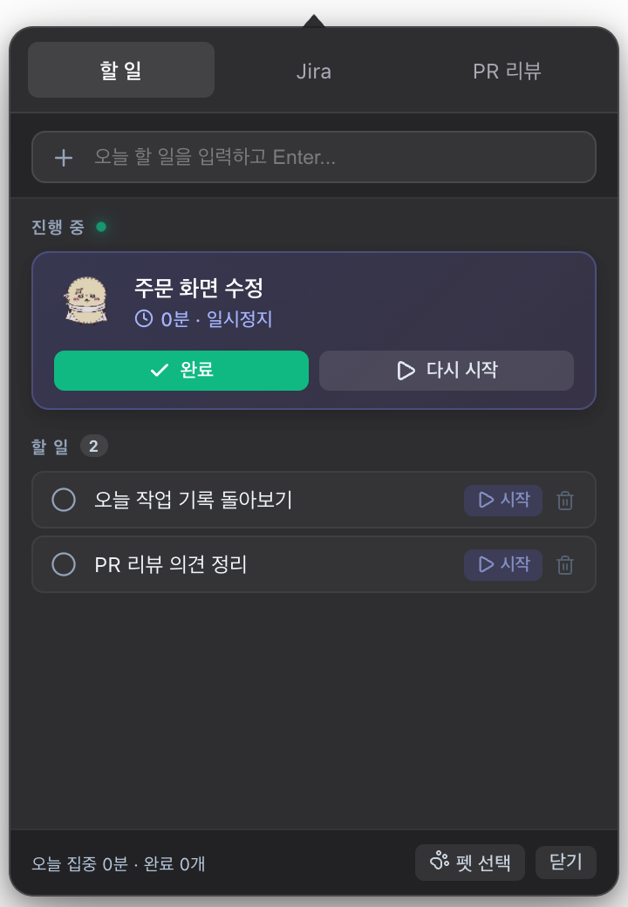
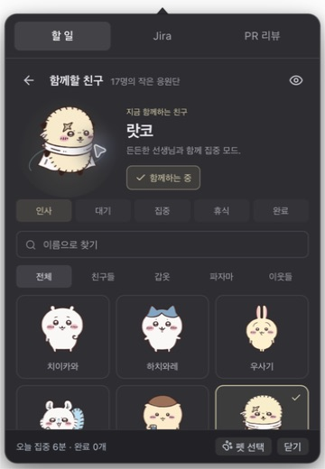
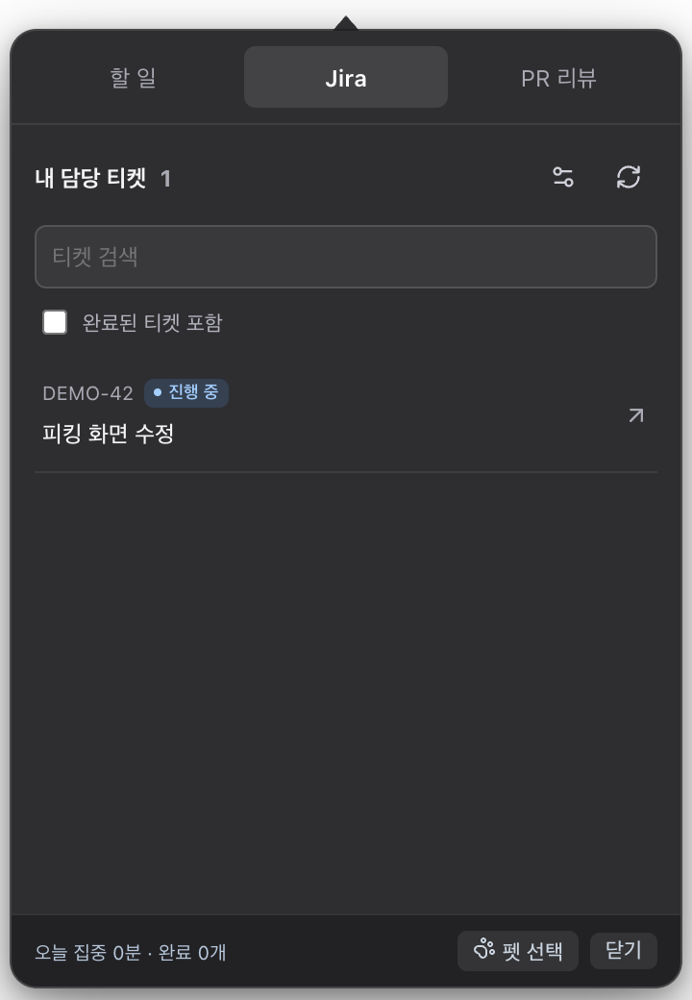
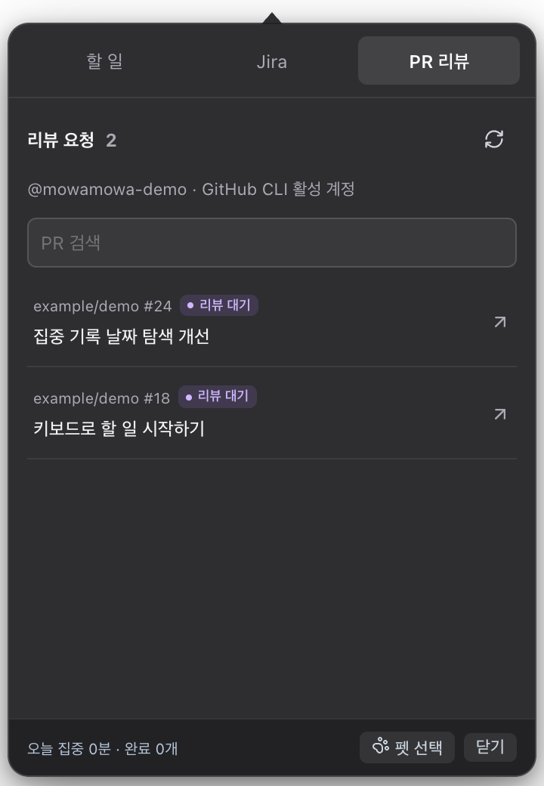

# MowaMowa · 모와모와

**タスクはメニューバーに。集中の相棒はデスクトップに。**

[English](README.md) · [한국어](README.ko.md) · **日本語**

<p align="center"></p>

MowaMowa は、やることを整理し、集中する間そばにいてくれる小さな仕事の相棒です。メニューバーからタスク、担当 Jira チケット、GitHub のレビュー依頼を確認し、ひとつ選んでペットと一緒に始めましょう。


## 使い方

1. タスクを追加し、担当チケットやレビュー依頼を確認します。
2. ひとつの作業を開始し、タイマーとペットと一緒に集中します。
3. 日付ごとの集中時間と完了したタスクを振り返ります。

## 画面紹介

| メニューバーのタスク | 一緒に過ごすペット |
| --- | --- |
|  |  |
| 一行で追加し、今やることを開始。独立したメインウィンドウはありません。 | 17 種類から選べます。ラッコをクリックするとジャンプ、素早い5回転、光のエフェクトを見せます。 |

| 担当 Jira チケット | PR レビュー依頼 |
| --- | --- |
|  |  |
| チケット番号の横に状態バッジを表示。完了済みは必要なときだけ表示できます。 | 自分へのレビュー依頼を一覧表示。クリックすると GitHub で開きます。 |

ペットと選択画面はインストール済み macOS アプリのスクリーンショットです。タスク・Jira・PR は実際の UI に架空のデータを入れたデモです。

## インストール

**公開 DMG リリースと Homebrew インストールはまだ提供していません。** ソースからビルドするか、共有された DMG を使ってください。

DMG がある場合は開いて `MowaMowa.app` を「アプリケーション」へ移動します。ソースコード、Bun、Rust は不要です。

### ソースからビルド

macOS 13 以降、Bun 1.3.6、Rust stable、Xcode Command Line Tools が必要です。

```bash
git clone https://github.com/ckdwns9121/mowamowa.git
cd mowamowa
bun install --frozen-lockfile
bun run bundle:mac
open src-tauri/target/release/bundle/dmg
```

生成された DMG からインストールしてください。現在の Mac のアーキテクチャ用にビルドします。

Universal ビルド（Apple Silicon と Intel）:

```bash
rustup target add aarch64-apple-darwin x86_64-apple-darwin
bun run bundle:mac:universal
```

出力先: `src-tauri/target/universal-apple-darwin/release/bundle/`。

### 初回設定

- タスク・ペット・タイマーは外部アカウントなしで使えます。
- Jira タブでサイト URL、メールアドレス、API トークンを入力します。
- PR レビューは GitHub CLI を使います。`gh auth login` でログインし、接続ボタンを押してください。`gh auth status` で有効なアカウントを確認できます。

インストール版と開発版はデータ・設定・キーチェーンを分離します。この分離されたインストール版の再インストールでは、その版の記録が保持されます。以前の共通保存領域を使用する版や開発版のデータ・トークンは自動移行せず、初回は新しい設定で開始します。以前のデータやキーチェーン項目は削除・移動しません。以前の記録を引き継ぐ場合は、この版への切り替え前に別途移行が必要です。終了はメニューバーアイコンを右クリックしてください。

## データと接続

タスクと集中記録はローカル SQLite に保存します。Jira トークンは既定で macOS キーチェーンを、GitHub はローカルの GitHub CLI 認証を使います。接続したサービスの一覧を取得する際は Jira・GitHub に通信します。PR は接続ボタンを押す前には取得しません。

## 開発

```bash
bun run tauri dev
bun run build
bun test
bun run verify:fsd
cargo test --manifest-path src-tauri/Cargo.toml --lib
```

Tauri 2・React 19・TypeScript・Rive・SQLite を使用しています。[MCP 連携](docs/technical/README.md)も利用できます。

## キャラクターについて

ちいかわのキャラクターを使用した非公式ファンプロジェクトです。原作者・権利者と提携した公式アプリではありません。キャラクターの名称・イラストの権利は各権利者に帰属します。

不具合や提案は [Issues](https://github.com/ckdwns9121/mowamowa/issues) へ。
